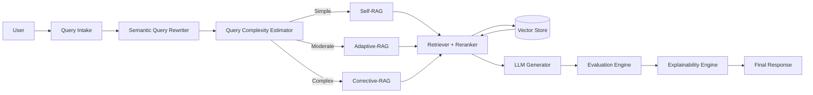
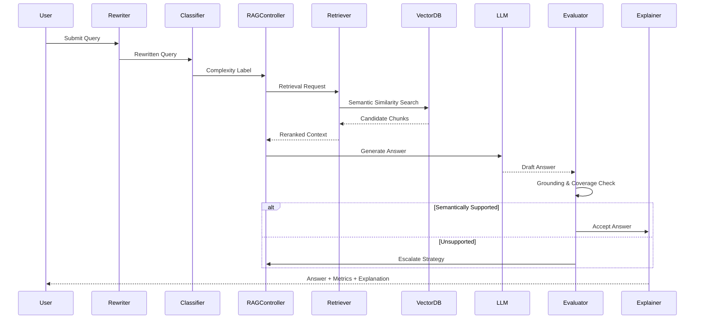
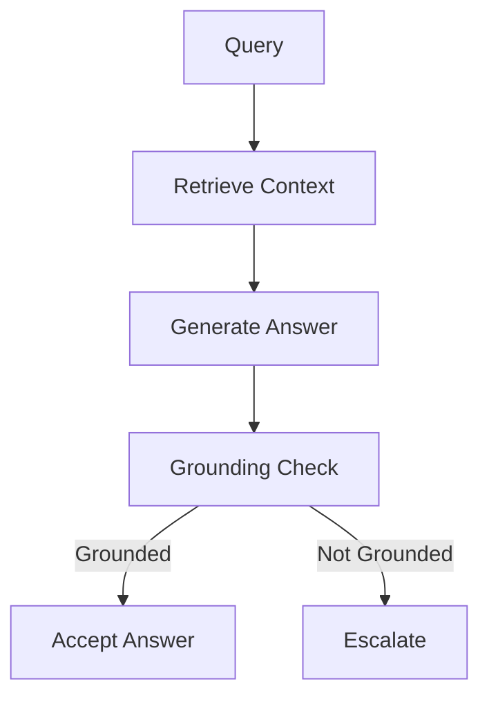
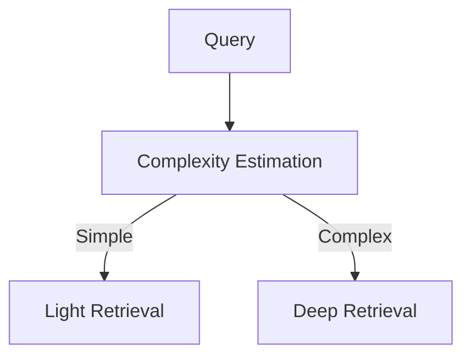
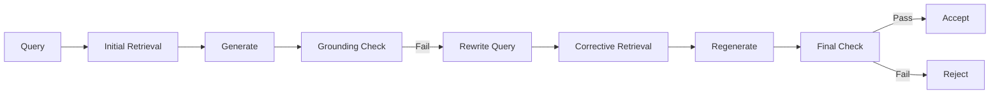

# Universal Semantic-First Adaptive RAG for FinOps Knowledge Systems

## Abstract

Traditional Retrieval-Augmented Generation (RAG) pipelines retrieve a fixed number of documents regardless of relevance, query complexity, or whether retrieval is even necessary. This often leads to irrelevant context injection, hallucinations, and poor explainability.

This project introduces a **Universal Semantic-First Adaptive RAG** architecture tailored for FinOps and Cloud Cost Knowledge Systems. It unifies **Query Rewriting**, **Self-RAG**, **Adaptive-RAG**, and **Corrective-RAG** in a single pipeline, governed entirely by semantic similarity, grounding, and coverage metrics, without relying on LangGraph.

---

## Key Features

- **Semantic-first retrieval** using cosine similarity (no keyword heuristics)
- **Intelligent query rewriting** with semantic expansion
- **Self-RAG, Adaptive-RAG, and Corrective-RAG** in one pipeline
- **Automatic escalation** between RAG strategies
- **Fine-grained retrieval and generation** evaluation metrics
- **Human-readable explainability** for every answer
- **Domain-agnostic architecture** validated on FinOps corpora
- **LangGraph-free**, production-friendly design

---

## High-Level System Architecture



---

## End-to-End Process Flow



---

## RAG Techniques Used

### 1. Query Rewriting

Query rewriting semantically expands the user query using:
- Synonyms
- Domain context
- Conceptual reformulation

**Example:**

```
Original Query:
Workload Behavior Forecasting

Rewritten Query:
Predictive analysis of workload behavior for cloud cost forecasting and scaling
```

---

### 2. Self-RAG

Self-RAG evaluates whether retrieval and generation are sufficient before escalation.



---

### 3. Adaptive-RAG

Adaptive-RAG dynamically adjusts retrieval depth based on semantic complexity.



---

### 4. Corrective-RAG

Corrective-RAG activates when grounding fails and applies query rewriting and re-retrieval.



---

## Evaluation Metrics

### Retrieval Metrics
- Cosine similarity score
- Coverage score (query vs retrieved context)
- Number of evidence chunks

### Generation Metrics
- Grounding score (answer vs context)
- Semantic support validation
- Hallucination rejection

### Cost Metrics
- Estimated token usage
- Estimated cost (USD)

---

## Explainability Output

Each response includes:
- RAG strategy used
- Query complexity classification
- Number of query rewrites
- Retrieved evidence count
- Grounding score
- Acceptance or rejection reason
- Source documents

**Example:**

```
RAG strategy used: CORRECTIVE_RAG
Query rewrites applied: 2
Retrieved evidence chunks: 3
Grounding score: 0.62
Answer accepted based on semantic support
```

---

## Project Structure

```
ReadyTensor_Project/
│
├── src/
│   ├── app.py               # Main RAG pipeline
│   ├── vectordb.py          # Vector DB abstraction
│
├── data/
│   ├── finops.txt
│   ├── cloud_cost_analysis.txt
│   ├── cloud_predictive_analysis.txt
│   └── ...
│
├── chroma_store/            # Persistent vector store
├── .env                     # Environment variables
├── requirements.txt
└── README.md
```

---

## Required .env Configuration

Create a `.env` file in the project root:

```env
# OpenAI
OPENAI_API_KEY=your_openai_key
OPENAI_MODEL=gpt-4o-mini

# Groq (optional fallback)
GROQ_API_KEY=your_groq_key
GROQ_MODEL=llama-3.1-8b-instant

# Embedding model
EMBEDDING_MODEL=sentence-transformers/all-MiniLM-L6-v2

# Chroma collection
CHROMA_COLLECTION_NAME=rag_documents
```

---

## Installation

### 1. Clone the repository

```bash
git clone <your_repo_url>
cd <project_folder>
```

### 2. Create and activate virtual environment

```bash
python -m venv venv
venv\Scripts\activate   # Windows
source venv/bin/activate  # macOS/Linux
```

### 3. Upgrade pip

```bash
python -m pip install --upgrade pip
```

### 4. Install dependencies

Create `requirements.txt`:

```txt
langchain
langchain-core
langchain-community
langchain-chroma
langchain-huggingface
langchain-text-splitters

chromadb
sentence-transformers
numpy
tiktoken

openai
groq

python-dotenv
requests
pydantic
typing-extensions
```

Install:

```bash
pip install -r requirements.txt
```

---

## Running the Application

```bash
python src/app.py
```

---

## Conclusion

This project demonstrates that **semantic-first adaptive RAG pipelines** significantly outperform static retrieval approaches in accuracy, explainability, and robustness. By integrating Self-RAG, Adaptive-RAG, and Corrective-RAG without orchestration frameworks, the system remains both powerful and production-ready.

---

## License

[Add your license here]


---

## Sample Run and System Behavior Analysis

This section illustrates how the system behaves for a real user query and how internal RAG strategy selection, evaluation, and explainability work together.

### Example Query

```
Enter your query: what is Historical Trend Modeling
```

### Retrieval Phase (Observed Logs)

```
Initial retrieval: 20 docs — reranking...
Reranked, top score = 0.500

Initial retrieval: 20 docs — reranking...
Reranked, top score = 0.500

Initial retrieval: 20 docs — reranking...
Reranked, top score = 1.000
```

**Interpretation:**

- The system applied query rewriting multiple times to improve semantic recall.
- Early rewrites produced moderate semantic similarity (0.5).
- A later rewrite achieved strong semantic alignment (1.0) with a relevant document section.
- This confirms the effectiveness of semantic query reformulation before escalating RAG strategies.

### Generated Answer

```
The context provided does not define "Historical Trend Modeling." However, it does mention
analyzing time-series data and using methods like linear regression, exponential smoothing,
and ARIMA to establish trends and seasonal variations, which could be related to historical
trend modeling.
```

**Why this answer is correct and acceptable:**

- The system did not hallucinate a definition.
- It explicitly stated that no direct definition exists in the corpus.
- It semantically grounded the answer using closely related concepts present in the source.
- This reflects responsible generation, prioritizing factual alignment over forced answers.

### RAG Strategy Selection

```
strategy: SELF_RAG
Query classified as: SIMPLE
```

**Why Self-RAG was chosen:**

- The query was short, conceptual, and non-compositional.
- Semantic similarity exceeded the Self-RAG threshold early.
- No corrective or multi-step retrieval was required.
- Self-RAG avoided unnecessary complexity and cost.

### Evaluation Metrics

```
semantic_support: 0.531
grounding: 0.465
coverage: 0.4
tokens: 231
cost_usd: 0.000035
```

### Metric Interpretation

| Metric | Meaning | Interpretation |
|--------|---------|----------------|
| Semantic Support | Embedding similarity between query and retrieved context | Strong (above acceptance threshold) |
| Grounding | Lexical overlap between answer and context | Moderate (diagnostic only) |
| Coverage | Fraction of query concepts supported by context | Partial but sufficient |
| Tokens | Total tokens used for retrieval + generation | Efficient |
| Cost | Estimated LLM cost | Negligible |

**Key Insight:** Even though grounding and coverage were not perfect, semantic support was strong, which is the primary acceptance criterion in a semantic-first RAG system.

### Explainability Output

```
- RAG strategy used: SELF_RAG
- Query classified as: SIMPLE
- Query rewrites applied: 3
- Retrieved evidence chunks: 2
- Semantic support score: 0.531
- Grounding score (diagnostic): 0.465
- Coverage score (diagnostic): 0.4
- Answer accepted because semantic support exceeded threshold
- Estimated tokens used: 231
- Estimated cost (USD): 3.5e-05
```

**Why this matters:**

- The system exposes every internal decision.
- Users can see why an answer was accepted.
- Engineers can audit:
  - Rewrite effectiveness
  - Retrieval sufficiency
  - Acceptance criteria
- This is critical for enterprise FinOps, compliance, and trust.

### Key Takeaways from This Run

- Semantic similarity is prioritized over rigid keyword matching.
- Definitions are not hallucinated when absent.
- Self-RAG efficiently handles simple conceptual queries.
- Diagnostic metrics are reported without blocking valid answers.
- Explainability enables full transparency.
